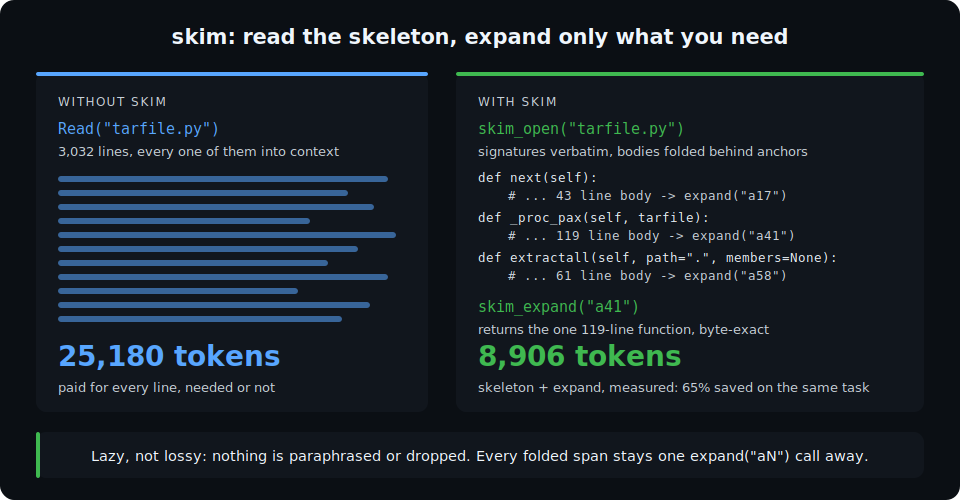
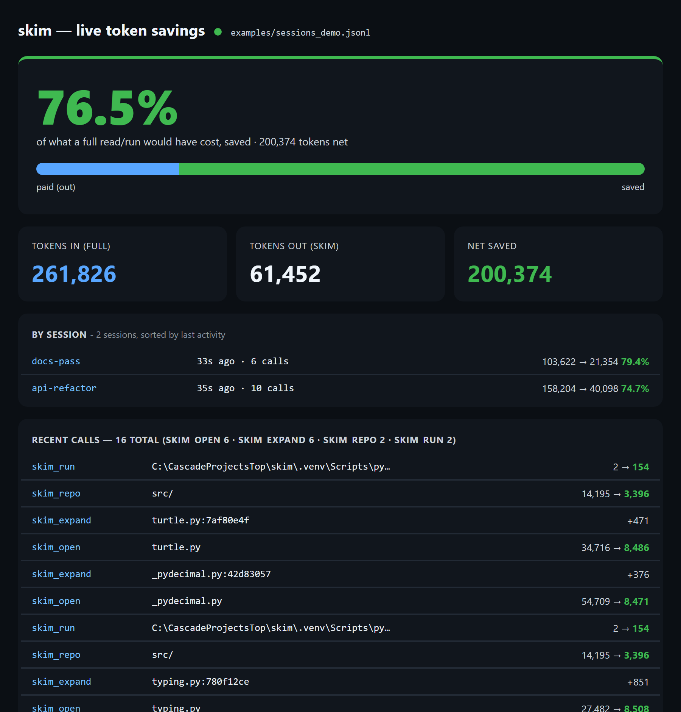

# skim

[](https://github.com/helloderekg/skim-mcp/actions/workflows/ci.yml)
[](https://pypi.org/project/skim-mcp/)
[](pyproject.toml)
[](LICENSE)

Token-efficient **skim-then-expand** I/O for agentic models (Claude Code / desktop Claude).

> Independent community project — **not affiliated with, endorsed by, or sponsored by Anthropic**.
> No telemetry; runs entirely on your machine. See [Trademarks, privacy & license](#trademarks-privacy--license).

Instead of reading a whole large file into context, the model calls `skim_open(path)` and gets a
compact **skeleton** — structure, signatures, and (for logs/data) preserved critical values like ids,
numbers, dates, and error codes — plus **anchor ids**. It reads the skeleton cheaply, then calls
`skim_expand(handle, anchors=[...])` to pull only the exact spans it needs, **verbatim and lossless**.

Compression is *lazy*, not *lossy*: nothing is paraphrased or destroyed, only deferred. Expansion is
always one call away — which is what makes it safe for a closed model that can't ingest latent vectors.



## What it does that other tools don't

The mainstream tools are **lossy in context** — repo-maps and `--compress` drop function bodies;
summarizers and compression models paraphrase. The closest neighbors either cover code only, or show
the model a *transformed* view and keep originals in a side cache. skim's line is stricter: **whatever
lands in context is verbatim source, and everything not shown is one anchored expand away** — an agent
can edit code from what it read without re-reading. That holds everywhere:

- **Files** — Python (`ast`) + ~17 languages (tree-sitter); bodies folded, one `expand` away.
- **Whole repos** — `skim_repo` builds a ranked, token-budgeted map; expand exact code from any file.
- **Command output** — `skim_run` compresses verbose test / build / log output, fully recoverable.
- **Data & logs** — a generic path with a **retention guarantee** (ids, numbers, error codes, negations
  are promoted into the skeleton, never silently dropped) and **dedup** of repeated blocks.

See [DESIGN.md](DESIGN.md) for the architecture and verified prior-art positioning.

## Falsifiable, not claimed

A reduction percentage is marketing until you can check it. skim ships the checker:

```bash
uv run skim-verify path/to/your/gnarliest_file.py     # any file at all; exit code tells CI
```

Five invariants, verified on **your** files, locally: every non-blank line recoverable, expands
byte-exact, anchors in-bounds, reconstruction equal to the decoded file, deterministic output. The
test suite enforces the same contract with Hypothesis fuzzing on every path; a reproducible `FAIL`
on any readable file is a bug — please report it. Summarize-first tools cannot ship this command,
because for them the equivalent check fails by design.

The cost-vs-correctness question has its own open yardstick — [eval/ACCURACY.md](eval/ACCURACY.md)
prices every eval question under a full read vs skim (including the rows where skim **loses**),
and any other context tool can be scored under the same protocol.

## Built to be audited

- **Under 2,000 lines of stdlib Python for the whole package** (the reading engine is ~1,200) — no
  ML models to download, no framework, no telemetry, dependency surface of one (`mcp`, plus
  optional `tiktoken`/tree-sitter extras). An afternoon's security review covers all of it:
  [SECURITY.md](SECURITY.md) is the threat model.
- **A kill switch for every surface that isn't read-only:** `SKIM_RUN_DISABLED=1` removes the
  shell tool, `SKIM_PATCH_DISABLED=1` removes the file editor; the readers keep working.
- **Windows is a first-class platform, not a port:** command output decoded as UTF-8 (no cp1252
  mojibake), process trees actually killed on timeout (`taskkill /F /T`), CRLF preserved by
  `skim_patch`, and CI runs the full suite on `windows-latest` alongside Ubuntu.

## Try the core (no install)

```bash
python demo.py path/to/file.py            # measured before/after token counts
python demo.py                            # demo on examples/sample.log (retention + dedup)
```

## Results (hard data)

Every number below is generated **live** by `uv run python benchmarks.py` — full reproducible tables in
**[BENCHMARKS.md](BENCHMARKS.md)**. Measured on the running interpreter's standard library (real code);
token counts via tiktoken `cl100k_base` (a proxy for Claude's tokenizer; ratios are tokenizer-robust).

**Token savings on real code** — 60 Python stdlib files: **387,911 → 122,660 tokens (68% fewer, 3.16×)**;
per-file 1.5×–11×; **100% lossless**, deterministic; ~linear runtime (~4 ms / 1k lines); pure CPU, no
GPU, no network, no model calls.

**Multi-language** (tree-sitter, `[lang]` extra) — the *same* lossless engine on JS / TS / Go / Rust /
Java / C / C++ / Ruby / PHP / C# and more. Example: a 481-line JavaScript module → **6.6× / 85% saved, lossless**.

**1:1 before/after on a real task (distribution-level)** — *"read the largest function in this module"*;
the model opens the file, reads the skeleton, expands exactly the one function it needs. **Same answer,
full skim cost (skeleton + expand) counted, across 24 large modules:**

| file | lines | function read | full read | skim (skeleton+expand) | saved |
|---|---:|---|---:|---:|---:|
| `tarfile.py` | 3,032 | `_proc_pax` (119 lines) | 25,180 | 8,906 | **65%** |
| `optparse.py` | 1,682 | `parse_args` (37) | 12,830 | 5,610 | **56%** |
| `pathlib.py` | 1,436 | `walk` (43) | 11,242 | 5,421 | **52%** |
| `bdb.py` | 921 | `effective` (48) | 7,279 | 3,243 | **55%** |
| `socketserver.py` | 864 | `serve_forever` (27) | 5,824 | 3,615 | **38%** |
| **24-file total** | | | **176,897** | **71,877** | **59%** |

Per-task savings: **median 51%, mean 51%, range 30–91%** across 24 tasks — the honest distribution, not a
cherry-picked best case. The win shrinks when you need most of a file.

**Head-to-head — same 30 files** (`compare.py` + real Repomix via `npx`):

| approach | tokens | % of full | lossless? |
|---|---:|---:|:--:|
| full read (Claude `Read`) | 184,277 | 100% | yes |
| **skim** | **64,043** | **34.8%** | **yes (lazy-expand)** |
| Repomix `--compress` | 105,963 | 57.5% | no (bodies dropped) |
| signatures-only (Aider/Basemind mechanism) | 20,276 | 11.0% | no |

skim is the **only lossless** option and uses **40% fewer tokens than Repomix `--compress`**. The repo-map
approach is ~3× smaller but discards bodies/docstrings/comments irreversibly. (Basemind is pure Rust and
wasn't installed; its row reproduces the signatures-only mechanism — see [COMPARISON.md](COMPARISON.md).)

**Correctness:** 0 of 54,215 non-blank lines unrecoverable across 80 files; 202 tests / ~80% coverage with
Hypothesis property fuzzing of both paths; an ~18,000-case adversarial campaign (every bug found is fixed
and regression-locked). Reproduce: `uv run python bench.py` / `pytest` / `benchmarks.py`.

## Run as an MCP server

The one-liner (installs from PyPI on first run, tree-sitter languages included):

```bash
claude mcp add skim -- uvx --from "skim-mcp[lang,tokens]" skim-mcp
```

Or from source:

```bash
git clone https://github.com/helloderekg/skim-mcp.git && cd skim-mcp
uv sync --extra lang                       # MCP SDK + multi-language (tree-sitter); drop --extra lang for Python-only
```

Register with Claude Code (use the repo's absolute path; forward slashes work on Windows):

```bash
claude mcp add skim -- uv run --directory /abs/path/to/skim-mcp skim-mcp
```

Or Claude Desktop — add to `claude_desktop_config.json` (`%APPDATA%\Claude\` on Windows,
`~/Library/Application Support/Claude/` on macOS), then restart:

```json
{
  "mcpServers": {
    "skim": {
      "command": "uv",
      "args": ["run", "--directory", "/abs/path/to/skim-mcp", "skim-mcp"]
    }
  }
}
```

(If `uv` isn't found, use its full path from `where uv` / `which uv`.)

### Tools

- `skim_open(path, query="")` → compact skeleton + anchor ids (read the skeleton; ids are in its `expand("aN")`
  markers). Pass `query` to also get `matches` (line + covering anchor) in the same call, no search round-trip.
- `skim_expand(handle, anchors=[...])` → exact verbatim spans. Items are anchor ids (`"a7"`) or literal
  line ranges (`"L120-180"`) for when a grep already gave you line numbers.
- `skim_search(handle, query)` → which anchors/lines contain a string, without reading them.
- `skim_run(command)` → run a shell command, get a compact expandable view of its output (tests / builds / logs).
- `skim_repo(path, query)` → a lossless, ranked, token-budgeted map of a whole repo; expand exact code from any
  file. Ranked by query match when you pass one, else by **import-graph centrality** (PageRank over which files
  import which), so the load-bearing modules surface first.
- `skim_patch(handle, anchor, new_text)` → replace exactly one expanded span **on disk**, drift-safe: refused
  if the file changed since `skim_open`, LF/CRLF preserved, result re-verified from disk, fresh handle returned.
  Because expands are verbatim, an edit built from one applies safely — *read 8% of the file, edit it anyway*.
  (`SKIM_PATCH_DISABLED=1` turns it off.)
- Spans are also **MCP resources**: `@skim:skim://doc/<handle>/span/<anchor>` pulls a span by reference.

## What it looks like in practice

**Fix a bug in a big module you barely need.** The task: "why does `_proc_pax` mishandle pax
headers?" in `tarfile.py` (3,032 lines, 25,180 tokens). Claude calls `skim_open`, reads a
skeleton with every signature, spots `_proc_pax`, expands that one anchor, and answers from the
exact 119-line body. Measured cost: 8,906 tokens including the skeleton and the expand. Same
answer, 65% fewer tokens (see the [benchmark table](#results-hard-data) — median across 24 such
tasks is 51%).

**Get your bearings in an unfamiliar repo.** `skim_repo(".", query="rate limit")` returns the
most relevant files' skeletons, ranked, inside one token budget, each with its own handle. Claude
reads the map, expands the two functions that matter from two different files, and starts editing
with the rest of the repo still unread but reachable.

**A red CI run with 400 lines of noise.** `skim_run("pytest -q")` returns the exit code plus a
compact view: repeated boilerplate collapses to "identical to a3" pointers, and the retention
layer promotes the load-bearing literals (error codes, file paths, counts) into view so the
failure is visible without expanding anything. When Claude needs the full traceback, it expands
that one block.

**When not to skim (honesty).** A 40-line config file, or a file you're about to rewrite
wholesale: just read it. The skeleton wrapper costs more than it saves on tiny inputs, and the
[meter](#see-your-savings-live) will show those rows as negative rather than hiding them. skim's
win is the everyday case where you need 40 lines out of 2,000.

## Getting Claude to use skim

**Mounting skim makes the tools available — it does not make Claude use them.** Claude picks a tool per
task, and its default for "read/review this file" is the built-in **Read**, not `skim_open`. Smaller
models (e.g. Haiku) are especially unlikely to reach for an MCP tool on their own. So skim saves tokens
only when it's actually invoked. Two ways to get there:

**1. Ask for it, per task:**

> Use skim to review `src/big_module.py`
> Map this repo with `skim_repo` before you start
> Run the tests through `skim_run`

**2. Make it automatic — add a rule to your `CLAUDE.md`** (a project one, or global `~/.claude/CLAUDE.md`)
so Claude reaches for skim without a reminder every turn:

```
When the skim MCP tools are available, prefer skim_open (files) and skim_repo (directories/repos) over
the built-in Read for anything larger than ~300 lines, and skim_run for verbose command output. Expand
only the spans you need — skim is lossless, so skimming first is never risky, only cheaper.
```

skim also ships a "prefer skim" instruction to the model, but models don't reliably act on server-level
instructions — the `CLAUDE.md` rule is what pulls hard enough, especially for smaller models. You can
confirm it's wired up any time: tell a session *"use skim to open &lt;a big file&gt;"* and watch the
[meter](#see-your-savings-live) tick.

**Or let skim do both steps — registration *and* the rule — in one idempotent command:**

```bash
uv run skim-mcp install                              # from a source checkout (project ./CLAUDE.md rule)
uvx --from "skim-mcp[lang,tokens]" skim-mcp install  # from PyPI
skim-mcp install --rule global                       # write the rule to ~/.claude/CLAUDE.md instead
skim-mcp install --print-only                        # show what it would do, change nothing
```

Re-running never duplicates the rule; if the `claude` CLI isn't on PATH it prints the exact manual
command and the Claude Desktop JSON instead.

## See your savings live

Mount skim, then run the meter in a second terminal — a tiny localhost dashboard (pure stdlib, no
network, no deps) that reads the same `skim_calls.jsonl` the server writes and refreshes every second:

```bash
uv run skim-meter                        # -> http://127.0.0.1:17321
uv run skim-meter --once                 # one-shot text snapshot instead of the web view
uv run skim-meter --price-per-mtok 3     # optional: also show ~dollars saved at YOUR rate
```

It shows, in real time: **tokens in** (what reading those files / running those commands in *full* would
have cost), **tokens out** (what skim actually put into context — skeletons plus every expand/search),
and **% saved** = `1 - out/in`, **broken down by session**. It's honest — expands eat into the number,
and a `skim_run` on a tiny output can even net negative.



**Per session:** every skim server process stamps a session id on each call, and Claude Code spawns one
process per session — so the dashboard lists **every session** (even before it has used skim), sorted by
**last activity**. Each row is labeled by your `SKIM_SESSION_LABEL` if you set one, else by the **first
file/repo that session touched** (else *idle*), alongside its **start time** and short id so you can tell
them apart. A **Clear** button (or `skim-meter --clear`) archives the log to a timestamped *ghost* file and
resets the meter to zero — nothing is lost. (MCP doesn't tell the server which *sub-agent* issued a call,
so per-connection/session is the finest split available server-side.)

## Tests

```bash
uv sync --extra dev
uv run pytest                  # unit + property-based fuzzing of the invariants (202 tests, ~80% coverage)
uv run python bench.py         # invariant sweep + compression over the standard library
uv run python check_invariant.py <file>   # check one file against the invariants
```

The suite enforces six invariants for **any** input — lossless, round-trip-exact, reconstruction-exact
(`full_text` equals the decoded file byte-for-byte), in-bounds, deterministic, never-crash — via
hand-written edge cases, the real standard library, and Hypothesis fuzzing of both the code and
generic paths.

**Measure the expand-loop yourself:** [eval/QUESTIONS.md](eval/QUESTIONS.md) is a 7-question
under-fetch eval (every answer hidden behind an anchor, locked by a test);
`uv run python eval/score_expand_loop.py` scores a real session's log against it, and
[eval/ACCURACY.md](eval/ACCURACY.md) prices each question (full read vs skim, negatives included) —
the accuracy-vs-cost yardstick other context tools are invited to run against.

## Limitations (honest)

- **Code skeletons cover Python (`ast`) + ~17 languages via tree-sitter** — JS, TS, Go, Rust, Java, C,
  C++, Ruby, PHP, C#, Kotlin, Swift, Scala, Bash, Lua, R. Install the optional `[lang]` extra; other text
  falls back to the generic (lossless) block path. The long tail of ~300 tree-sitter grammars is
  incremental (each language's folding is verified against real parses before it ships).
- **Dense repetitive logs get Drain-style templates** (`~412x GET /api/<*> took <*>ms`) so the skeleton
  shows *what* repeats; structured JSON/CSV skeletons are still roadmap, so compression there is modest.
- **It depends on the model calling `expand`.** If the model answers from the skeleton when it needed a
  collapsed body, it can be wrong. A steering hint mitigates this; `skim_calls.jsonl` lets you measure it.
- **Functions defined inside `if` / `try` blocks aren't shown as signatures** (still lossless and expandable).
- **`skim_run` runs shell commands on your machine** (to capture and compress their output), with the
  privileges of the server process — the same capability class as an agent's Bash tool. Mount skim only
  where you'd let an agent run commands; a prompt-injected model could invoke a destructive command.
  Set `SKIM_RUN_DISABLED=1` to mount skim read-only (the shell tool refuses, the readers keep working).
  Full threat model in [SECURITY.md](SECURITY.md).
- **Handles live in the server process's memory.** They last the session (Claude Code runs one skim
  process per session); after a restart an old handle returns a clean `unknown handle` error — re-open.
  Handles are content-hashed, so a re-opened *changed* file gets a new handle and stale anchor ids can
  never silently point at different lines.
- **Savings depend on usage:** large on big files you read part of, a wash on small files or when you need
  most of a file. Token counts use tiktoken (a proxy for Claude's tokenizer); ratios are robust.

## Status & roadmap

**Shipped:** Python `ast` + multi-language tree-sitter code skeletons (~17 languages, each verified
against real parses), a generic block path with retention + dedup + Drain-style templating for dense
logs, `skim_run` (lossless command/test-output compression with process-tree-safe timeouts),
`skim_repo` (whole-repo lossless map, ranked by query match or import-graph PageRank), spans as MCP
resources, an under-fetch eval harness, and `skim-meter` (a live token-savings dashboard) — all behind
an airtight test suite.

**Roadmap:** a structured-data skeleton for JSON/CSV (schema + value stats), the long tail of
tree-sitter languages, a hybrid push mode (auto-expand the top relevance-ranked anchor) if the
under-fetch eval shows models leaving answers on the table, and runner adapters so other context
tools can be scored on the [accuracy-vs-cost yardstick](eval/ACCURACY.md).

## Contributing, security, changelog

[CONTRIBUTING.md](CONTRIBUTING.md) has the five invariants every change must keep (lossless,
round-trip exact, in-bounds, deterministic, never-crash) and how to add a language.
[SECURITY.md](SECURITY.md) is the threat model and how to report privately.
[CHANGELOG.md](CHANGELOG.md) tracks releases; [RELEASING.md](RELEASING.md) is the release process.

## Trademarks, privacy & license

**Independent project.** skim is a community open-source project, **not affiliated with, endorsed by, or
sponsored by Anthropic PBC, OpenAI, or any other company.** "Claude", "Claude Code", and "Anthropic" are
trademarks of Anthropic, PBC; "Model Context Protocol" / "MCP" are used descriptively to indicate protocol
compatibility; "Aider", "Basemind", and "Repomix" are trademarks of their respective owners. All marks are
used nominatively, for identification and comparison only, and imply no endorsement. No third-party logos are used.

**Benchmarks.** Figures in this repo are measurements under the documented conditions (tool versions, flags,
corpus, token counter, date), reproducible via the published scripts — not guarantees under other conditions.
Comparative figures for Aider, Basemind, and Repomix were produced with their then-current public releases;
corrections welcome via an issue.

**Privacy & telemetry.** skim runs entirely on your machine. It makes **no network requests** and collects,
transmits, or sells **no data**. The only data written is a local `skim_calls.jsonl` log (skim tool calls —
file paths and span anchors — for your own debugging); it never leaves your computer. Delete it anytime, or
set `SKIM_LOG_FILE` to redirect it. It may contain paths/snippets from your own files; treat it like any local log.

**License.** [MIT](LICENSE). Runtime deps `mcp` (MIT, © Anthropic PBC) and `tiktoken` (MIT, © OpenAI) — see
[NOTICE](NOTICE). The dev-only test dep `hypothesis` is MPL-2.0, used unmodified and never bundled.

mcp-name: io.github.helloderekg/skim-mcp
